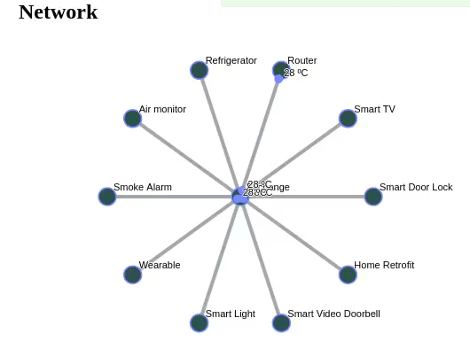

# :computer: :movie_camera: :mag_right: IoT live monitor

Repository to host ASSO (Software Systems Architecture - FEUP 2018) project.

## Overview

This project provides a manager of an IoT devices network. Beyond an analysis of the devices and the communication that is happening between them, a client can manage the network by adding new devices. Regarding each device, it’s possible to control the topics that each one is subscribing, publish a message, and update the messages consumed.

## Final result
 

## Authors
* [Hélder Antunes](https://github.com/HelderAntunes)
* [Inês Proença](https://github.com/inesfproenca)
* [Marcelo Ferreira](https://github.com/mferreira96)
* [Renato Abreu](https://github.com/renatoabreu11)
